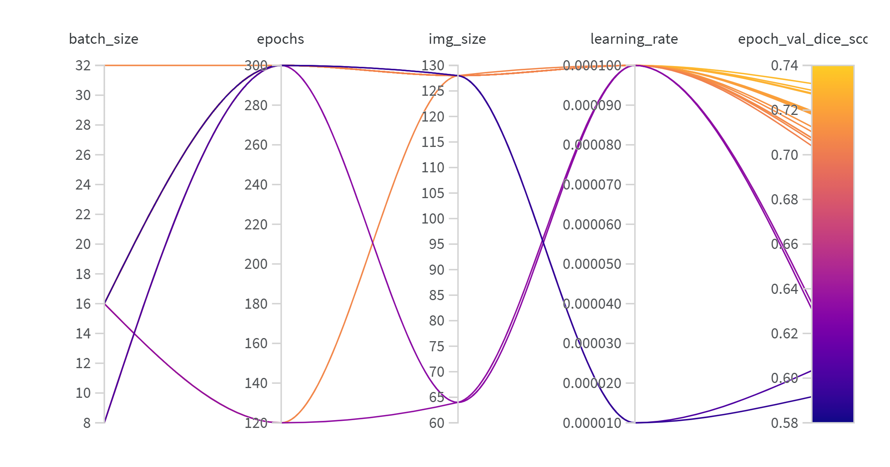
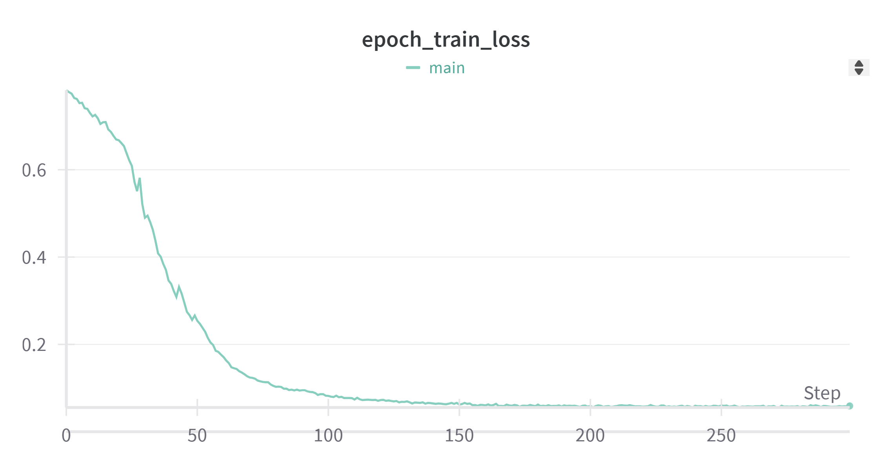
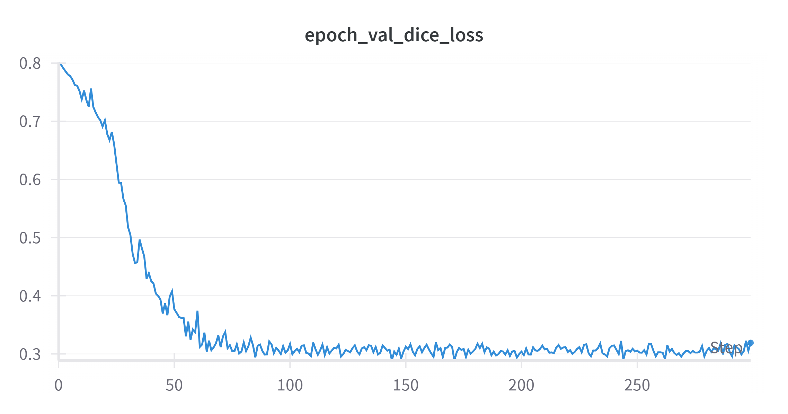
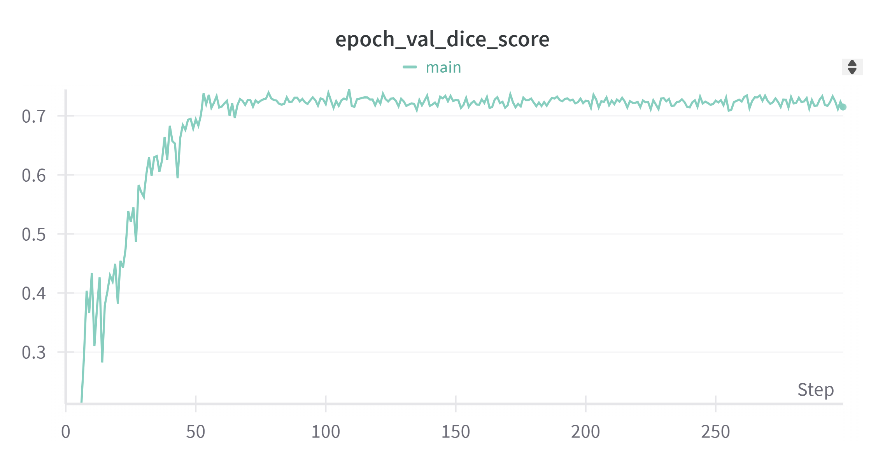
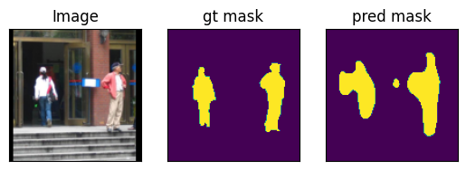
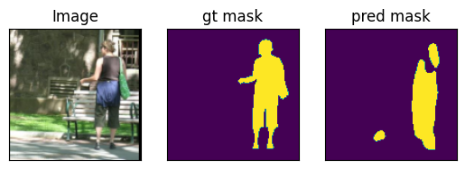
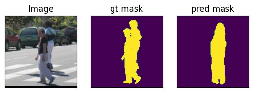
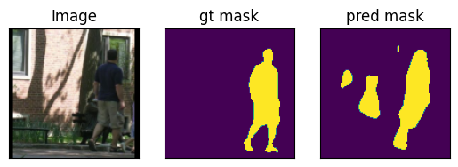

#  CNN on the Fudan Pedestrian segmentation dataset 
This is the implementation for NYU Tandon Image Video Processing Course Coding Assignment 4.

The code simple uses a hydra as configuring management.

The code is open sourced at: https://github.com/ermu2001/IVP/tree/master/CA4

## (a)
The data is cutted into  into an 80-10-10 train-val-test split.

For detail implementation, see self_split function of PennFudanDataset from data.py. The code is also attached to this report. The code for splitting is attached here:
```python

    def self_split(self, split):
        if self.shuffle:
            np.random.RandomState(42).shuffle(self.imgs)
            np.random.RandomState(42).shuffle(self.masks)

        if split == 'train':
            self.imgs = self.imgs[:int(len(self.imgs) * 0.8)]
            self.masks = self.masks[:int(len(self.masks) * 0.8)]
        elif split == 'val':
            self.imgs = self.imgs[int(len(self.imgs) * 0.8):int(len(self.masks) * 0.9)]
            self.masks = self.masks[int(len(self.masks) * 0.8):int(len(self.masks) * 0.9)]
        elif split == 'test':
            self.imgs = self.imgs[int(len(self.imgs) * 0.9):]
            self.masks = self.masks[int(len(self.masks) * 0.9):]

```

## (b)
The training data was augmented/preprocessed with the folloing processing steps:
1. *resize_with_long_edge*: the image is resized having the long edge to match the specific resolution.
2. *color_jitter*: the resized image is then processed with random color jittering with the folloing parameters:
   - brightness=0.1
   - contrast=0.1
   - saturation=0.1
   - hue=0.1
3. *random_adjust_sharpness*: the image is then adjust by the sharpness with factor 0.1 at probability 0.5.
4. *center_pad*: the final processed image is then paded with black having the image at center to form a square image at the specific resolution.

It is worth mentioning for validation, the image and mask is only processed with *resize_with_long_edge* and *center_pad* for the pixel mask to match the training image.

## (c)

The model is implemented in model.py. The code is also attached to this document.

This section briefly introduces the architecture of the implemented unet in a top-down narrative.

-  At highest abstraction, the unet is made up of *depth* number of downsapmling block module and *depth* number of upsampling  block module to ensure same input/output spatial resolution. At the lowest spatial resolution at middle of the model, there are two middle module that does not change the spatial resolution.

- Each upsample/downsample block module consist of two spatial shape identity convolution block and a upsample/downsample layer at the end.

- Each convolution block consist of a root mean square normalization layer, a convolution layer and a activation layer.

Generally, this unet architecture could be configured with:
- *depth*: number of upsample/downsample layer.
- *spatial_scale_factor*: the scaling factor for spatial resolution for each upsample/downsample module.
- *channel_scale_factor*: the scaling factor for channel number of each upsample/downsample layer.

The model will scale the channel number at first block of each upsample/downsample block module and scale the spatial resolution at each ending block of it. The downsampling uses max pooling while upsampling uses bilinear interpolation.

The main difference of this implementation from the recommended UNet architecture is listed:
1. I used Root Mean Square Normalization for normalization in the
convolution block
2. I've place the normalization layer in front of the convolution
layer instead of after it.
3. At the lowest resolution level (the middle of the Unet), I placed 4 convolution block in total.
4. At each spatial resolution stage, the channel of the feature was
upsampled by 4 times

## (d)
For training, adam optimizer is used with no *weight_decay*. A cosine annealing with warm up learning rate shcheduler is used. The details of the learning rate scheduler implementation could be found in class CosineAnnealingWarmupRestarts, utils.py.

Upon training, wandb is used to monitor the training statstics such as training and validation loss.

Aside from this, wandb sweep is used for hyperparameters tuning on some key hyperparameters: *learning_rate*, *batch_size*, *epochs* and *img_size*. The hyperparameter sweep experiment curves could be found at: https://wandb.ai/ermuzzz2001/pedestrian-detection/sweeps/bp8sw90v?nw=nwuserermu2001.

In the sweeping view, we can see that the model converges with validation dice score higher than 0.7 only when using learning rate 1e-4 and image size 128. And the having longer training epochs would result in better final output.



From the result, we can determine the best hyperparameter setting as:
- *learning_rate*=1e-4
- *batch_size*=16
- *epochs*=300
- *img_size*=128

The rest of this section shows the training dice loss, validation dice loss and validation dice score for the main run with the tuned hyper-parameters.

The training loss curve and validation loss is as listed, the model converges to a low loss after 100 epochs of training, ensuring a valid convergence. The validation loss did not rise since a consine learning was used and should count for less overfitting.






While during the process, the validation dice score rise to high and started gradually decrease, this could be recognized as overfitting to the training set.




## (e)
With the final model, the evaluation was run on the test set, where no data autmentation was added in the preprocessing. The final test set evaluation metrics are listed as following.
```
Test set: IoU: 0.7282012584100946, Dice Score: 0.7950285077095032, Soft Dice Loss: 0.2354467511177063
```

## (f)
The model was used to take pedstrain mask for in-distribution images. The image was from held out test set from the original FudanPed dataset. The results are as listed. From the result, the pedstrain was masked out, but the edge of the mask is noisy. And for some cases, there are hallucination where some part of the image where there is not pedstrain was marked as true in the mask.






For more details, checkout the attachted jupyter note book at the end of this document.

## (g)

Finally, the model was used to take pedstrain mask for out-distribution images. Comparing to in distribution samples, the out of distribution performance was rather worse, with more noisy on the edges for the mask and larger false mask in the image.


For more details, checkout the attachted jupyter note book at the end of this document.

# code
Attached to this document is the code for this experiments.
## train.py
```python
import hydra
from omegaconf import OmegaConf, DictConfig
import os.path as osp
from PIL import Image
import numpy as np
import logging
from tqdm import tqdm
import wandb
import torch
import torchvision

from model import (
    load_model,
    save_model,
)

from data import (
    PennFudanDataset,
    center_pad,
    resize_with_long_edge,
)

from utils import (
    get_device,
    get_dtype,
    dice_loss,
    get_iou,
    seed_everything,
    compute_dice_score,
)

logger = logging.getLogger(__name__)

def validate(model, val_dataset, device, dtype):
    model.eval()
    val_loader = torch.utils.data.DataLoader(
        val_dataset,
        batch_size=1,
        num_workers=1,
        shuffle=False,
    )
    ious = []
    dice_scores = []
    soft_dice_losses = []
    with torch.no_grad():
        for images, masks in tqdm(val_loader, leave=False):
            images = images.to(device, dtype=dtype)
            masks = masks.to(device)
            outputs = model(images)
            pred_masks = outputs > 0
            ious.extend(get_iou(pred_masks, masks).tolist())
            soft_dice_losses.append(dice_loss(outputs.sigmoid(), masks).tolist())
            dice_scores.append(compute_dice_score(pred_masks, masks).tolist())
    ious = np.mean(ious)
    dice_scores = np.mean(dice_scores)
    soft_dice_losses = np.mean(soft_dice_losses)
    # Add validation metrics here
    return ious, dice_scores, soft_dice_losses

def run(cfg):
    wandb.init(project=cfg.wandb.project, config=OmegaConf.to_container(cfg, resolve=True), name=cfg.wandb.name)
    seed_everything(cfg.train.seed, deterministic=True)
    model = load_model(model_cfg=cfg.model)

    num_params = sum(p.numel() for p in model.parameters())
    logger.info(f'Model has {num_params//1000:}K parameters')


    img_transform = torchvision.transforms.Compose([
        torchvision.transforms.Lambda(lambda x: resize_with_long_edge(x, cfg.train.img_size)),
        torchvision.transforms.ColorJitter(0.1, 0.1, 0.1, 0.1),
        torchvision.transforms.RandomAdjustSharpness(0.1, p=0.5),
        torchvision.transforms.Lambda(center_pad),
        torchvision.transforms.ToTensor(),
    ])
    mask_transform = torchvision.transforms.Compose([
        torchvision.transforms.Lambda(lambda x: resize_with_long_edge(x, cfg.train.img_size, Image.NEAREST)),
        torchvision.transforms.Lambda(center_pad),
        torchvision.transforms.Lambda(lambda x: torch.as_tensor(np.array(x).astype(bool))),
    ])

    train_dataset = PennFudanDataset(
        root=cfg.data.data_root,
        img_transforms=img_transform,
        mask_transforms=mask_transform,
        split='train',
    )

    val_dataset = PennFudanDataset(
        root=cfg.data.data_root,
        img_transforms=img_transform,
        mask_transforms=mask_transform,
        split='val',
    )

    dataloader = torch.utils.data.DataLoader(
        train_dataset,
        batch_size=cfg.train.batch_size,
        num_workers=cfg.train.num_workers,
        shuffle=True,
    )
    optim = hydra.utils.instantiate(cfg.train.optimizer, model.parameters())
    if 'scheduler' in cfg.train:
        if getattr(cfg.train.scheduler, 'warmup_epochs') is None:
            cfg.train.scheduler.warmup_epochs = cfg.train.scheduler.total_epochs // 10
        if getattr(cfg.train.scheduler, 'min_lr') is None:
            cfg.train.scheduler.min_lr = cfg.train.scheduler.max_lr / 1e3
        scheduler = hydra.utils.instantiate(cfg.train.scheduler, optim)
    else:
        scheduler = None
    loss_fn = dice_loss
    device = get_device(cfg.train.device)
    dtype = get_dtype(cfg.train.dtype)
    model.to(device=device, dtype=dtype)
    for epoch in range(cfg.train.num_epochs):
        model.train()
        epoch_losses = []
        for images, masks in tqdm(dataloader, leave=False):
            images = images.to(device=device, dtype=dtype)
            masks = masks.to(device)
            optim.zero_grad()
            outputs = model(images)
            pred_mask = outputs.sigmoid()
            loss = loss_fn(pred_mask, masks)
            loss.backward()
            epoch_losses.append(loss.item())
            optim.step()

        if scheduler is not None:
            scheduler.step()
            cur_lr = scheduler.get_lr()[0]
        else:
            cur_lr = cfg.train.optimizer.lr    
        val_iou, val_dice_score, val_dice_loss = validate(model, val_dataset, device, dtype)

        save_model(osp.join(cfg.output_dir, f'epoch{epoch:05}'), cfg.model, model)
        logger.info(f"""Epoch [{epoch}/{cfg.train.num_epochs}],
                      Train Loss: {np.mean(epoch_losses):.4f},
                      Validation IoU: {val_iou:.4f},
                      Validation Dice Score: {val_dice_score:.4f},
                      Validation Dice Loss: {val_dice_loss:.4f},
                      Learning Rate: {cur_lr:.6f}""")
        wandb.log({
            'epoch_train_loss': np.mean(epoch_losses),
            'epoch_val_iou': val_iou,
            'epoch_val_dice_score': val_dice_score,
            'epoch_val_dice_loss': val_dice_loss,
            'epoch_learning_rate': cur_lr,
        })

@hydra.main(version_base=None ,config_path="conf", config_name="config")
def main_run(cfg: DictConfig):
    print(OmegaConf.to_yaml(cfg))
    run(cfg)

if __name__ == "__main__":
    main_run()
```

## data.py
```python

import numpy as np
import requests
import torch
from torch import nn
import torchvision
import torchvision.transforms
import os
from PIL import Image
import torchvision.transforms.functional

def resize_with_long_edge(img, long_edge, interpolation=Image.BILINEAR):
    # Resize the image while maintaining aspect ratio
    w, h = img.size
    if w > h:
        new_w = long_edge
        new_h = int((h / w) * long_edge)
    else:
        new_h = long_edge
        new_w = int((w / h) * long_edge)
    return img.resize((new_w, new_h), interpolation)


def center_pad(img):
    # Get the size of the image
    w, h = img.size
    # Calculate the size of the new image
    new_w = max(w, h)
    new_h = new_w
    # Create a new image with a white background
    if img.mode == 'RGB':
        new_img = Image.new("RGB", (new_w, new_h), (0, 0, 0))
    elif img.mode == 'L':
        new_img = Image.new("L", (new_w, new_h), (0)) 

    # Paste the original image onto the new image
    new_img.paste(img, ((new_w - w) // 2, (new_h - h) // 2))
    return new_img


class PennFudanDataset(torch.utils.data.Dataset):
    shuffle = True
    def __init__(self, root, img_transforms=None, mask_transforms=None, split='train'):
        self.root = root
        self.img_transforms = img_transforms
        self.mask_transforms = mask_transforms
        self.imgs = list(sorted(os.listdir(os.path.join(root, "PNGImages"))))
        self.masks = list(sorted(os.listdir(os.path.join(root, "PedMasks"))))
        self.self_split(split)
        # Check for mismatches between images and masks         
        self.examine()


    def __getitem__(self, idx):
        img_path = os.path.join(self.root, "PNGImages", self.imgs[idx])
        mask_path = os.path.join(self.root, "PedMasks", self.masks[idx])
        image = Image.open(img_path).convert("RGB")
        mask = Image.open(mask_path)

        if self.img_transforms:
            image = self.img_transforms(image)
            mask = self.mask_transforms(mask)
        return image, mask

    def __len__(self):
        return len(self.imgs)

    def self_split(self, split):
        if self.shuffle:
            np.random.RandomState(42).shuffle(self.imgs)
            np.random.RandomState(42).shuffle(self.masks)

        if split == 'train':
            self.imgs = self.imgs[:int(len(self.imgs) * 0.8)]
            self.masks = self.masks[:int(len(self.masks) * 0.8)]
        elif split == 'val':
            self.imgs = self.imgs[int(len(self.imgs) * 0.8):int(len(self.masks) * 0.9)]
            self.masks = self.masks[int(len(self.masks) * 0.8):int(len(self.masks) * 0.9)]
        elif split == 'test':
            self.imgs = self.imgs[int(len(self.imgs) * 0.9):]
            self.masks = self.masks[int(len(self.masks) * 0.9):]


    def examine(self):
        imgs_from_png = set([img[:12] for img in self.imgs])
        imgs_from_mask = set([mask[:12] for mask in self.masks])
        if imgs_from_png != imgs_from_mask:
            print(f'imgs without masks: {imgs_from_png - imgs_from_mask}')
            print(f'masks without imgs: ', imgs_from_mask - imgs_from_png)
            raise ValueError("Mismatch between images and masks")


def get_dataset(data_root, img_transforms=None, mask_transforms=None):
    return PennFudanDataset(
        data_root,
        img_transforms=img_transforms,
        mask_transforms=mask_transforms
    )

if __name__ == "__main__":
    from PIL import ImagePalette
    data_root = "tmp/data/PennFudanPed"
    img_transforms = torchvision.transforms.Compose([
        torchvision.transforms.Resize(256, Image.BILINEAR),
        center_pad,
        torchvision.transforms.ToTensor(),
    ])
    mask_transform = torchvision.transforms.Compose([
        torchvision.transforms.Resize(256, interpolation=Image.NEAREST),
        center_pad,
        torchvision.transforms.Lambda(lambda x: torch.as_tensor(np.array(x).astype(np.int32))),
    ])


    dataset = get_dataset(
        data_root,
        img_transforms=img_transforms,
        mask_transforms=mask_transform
    )
    print(f"Loaded dataset with {len(dataset)} samples.")
    for img, mask in dataset:
        print("=" * 100)
        print("Image shape:", img.shape)
        # print(img.tolist())
        print(img)
        torchvision.transforms.functional.to_pil_image(img).save("test_img.png")
        print("=" * 100)
        print("Mask shape:", mask.shape)
        print(f'Mask unique values: {torch.unique(mask)}')
        # print(mask.tolist())
        print(mask)

        # display with lenna
        import matplotlib.pyplot as plt
        from matplotlib.colors import ListedColormap

        # Define 10 distinct colors
        # Create a colormap
        cmap = plt.get_cmap('tab10', 10)
        colors = (cmap(np.arange(10))[:, :3] * 255).astype(np.uint8)  # RGB values scaled to 0-255


        mask = Image.fromarray(mask.numpy().astype(np.uint8)).convert("P")
        mask.putpalette(colors.flatten().tolist())
        mask.save("test_mask.png")
        break

```

## utils.py
```python
import random
import torch
import numpy as np

def get_device(device=None):
    """Get the current device (GPU or CPU)."""
    if device is None:
        return torch.device('cuda' if torch.cuda.is_available() else "cpu")
    else:
        return torch.device(device)
    
def get_dtype(dtype='float32'):
    """Get the current data type (float32 or float16)."""
    dtype = dtype.lower()
    dtype = getattr(torch, dtype)
    return dtype

def dice_loss(pred_mask, gt_mask):
    """Calculate the Dice loss."""
    eps = 1e-6  # Smoothing factor to avoid division by zero
    pred_mask_flat = pred_mask.view(-1)
    gt_mask_flat = gt_mask.view(-1)
    intersection = (pred_mask_flat * gt_mask_flat).sum()
    return 1 - (2. * intersection + eps) / (pred_mask_flat.sum() + gt_mask_flat.sum() + eps)

def get_iou(pred_masks, masks):
    """Calculate the Intersection over Union (IoU)."""
    intersection = (pred_masks & masks).sum(dim=(1, 2))
    union = (pred_masks | masks).sum(dim=(1, 2))
    return (intersection + 1e-6) / (union + 1e-6)  # Add small value to avoid division by zero

def seed_everything(seed, deterministic):
    random.seed(seed)
    np.random.seed(seed)
    torch.manual_seed(seed)
    if torch.cuda.is_available():
        torch.cuda.manual_seed_all(seed)
    np.random.seed(seed)
    
    if deterministic:
        torch.use_deterministic_algorithms(True, warn_only=True)


def compute_dice_score(pred_mask, true_mask):
    intersection = torch.sum(pred_mask * true_mask)
    return (2. * intersection) / (torch.sum(pred_mask) + torch.sum(true_mask))


class CosineAnnealingWarmupRestarts(torch.optim.lr_scheduler.LambdaLR):
    def __init__(self, optimizer, warmup_epochs, total_epochs, min_lr=0, max_lr=0.1):
        self.warmup_epochs = warmup_epochs
        self.total_epochs = total_epochs
        self.min_lr = min_lr
        self.max_lr = max_lr
        self.cycle_length = total_epochs - warmup_epochs
        self.current_epoch = 0

        super(CosineAnnealingWarmupRestarts, self).__init__(optimizer, self.get_lr)

    def get_lr(self):
        if self.current_epoch < self.warmup_epochs:
            # Linear warmup
            return [self.min_lr + (self.max_lr - self.min_lr) * (self.current_epoch / self.warmup_epochs) for _ in self.base_lrs]
        else:
            # Cosine annealing
            cosine_decay = 0.5 * (1 + np.cos((self.current_epoch - self.warmup_epochs) / self.cycle_length * 3.141592653589793))
            return [self.min_lr + (self.max_lr - self.min_lr) * cosine_decay for _ in self.base_lrs]

    def step(self):
        self.current_epoch += 1
        super(CosineAnnealingWarmupRestarts, self).step()


```

## configs
```yaml
output_dir: tmp/output/first
wandb:
  project: "pedestrian-detection"
  name: "main"

model:
  in_channels: 3
  out_channels: 1
  kernel_size: 3
  main_channel: 8
  depth: 3
  spatial_scale_factor: 2
  channel_scale_factor: 4

data:
  data_root: tmp/data/PennFudanPed

train:
  batch_size: 16
  num_epochs: 300
  num_workers: 4
  img_size: 128
  dtype: bfloat16
  device: cuda
  seed: 42

  optimizer:
    _target_: torch.optim.Adam
    lr: 1e-4 # if 1e-3, the model will not converge
    # weight_decay: 0.0001

  scheduler:
    _target_: utils.CosineAnnealingWarmupRestarts
    total_epochs: ${train.num_epochs}
    warmup_epochs: null
    min_lr: null # this should be very small, if not, the model will not converge with some randomness, or have more warm up steps
    max_lr: ${train.optimizer.lr}
```

# Notebooks
The sweep notebook main.ipynb is mainly run on goolge colab compute platform. The visualization notebook eval.ipynb is run after training for visualization and test set evaluation.

eval.ipynb test the model on heldout test set and other pedestrian image from the internet.

